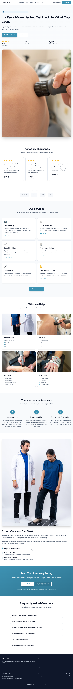

# Elite Physio - Physiotherapy Clinic Website

A modern, responsive marketing website for Elite Physio, a physiotherapy clinic serving the Gold Coast, Brisbane, and Sunshine Coast areas in Australia.

## Screenshot



## Features

- **Responsive Design** - Mobile-first approach with seamless experience across all devices
- **Modern Tech Stack** - Built with React 18, TypeScript, Vite, and Tailwind CSS v4
- **Interactive UI** - Smooth animations powered by Framer Motion
- **Component Library** - Comprehensive UI components using Radix UI primitives
- **Client-Side Routing** - Fast navigation with React Router v7
- **Form Handling** - React Hook Form integration for contact/booking forms
- **Accessible** - Built with accessibility best practices using Radix UI components

## Tech Stack

### Core
- **React** 18.3.1 - UI library
- **TypeScript** - Type-safe JavaScript
- **Vite** 6.3.5 - Fast build tool and dev server
- **React Router** 7.13.0 - Client-side routing

### Styling
- **Tailwind CSS** 4.1.12 - Utility-first CSS framework
- **Radix UI** - Unstyled, accessible UI primitives
- **Framer Motion** 12.23.24 - Animation library
- **Lucide React** 0.487.0 - Icon library

### Development
- **Jest** 30.x - Testing framework
- **React Testing Library** - Component testing utilities
- **TypeScript** - Strict mode enabled

## Project Structure

```
physiotherapy-clinic/
├── src/
│   ├── main.tsx                      # Entry point
│   ├── app/
│   │   ├── App.tsx                   # Root App component
│   │   ├── Root.tsx                  # Layout with Header + Footer
│   │   ├── routes.ts                 # Route definitions
│   │   ├── components/
│   │   │   ├── ui/                   # Reusable UI primitives
│   │   │   │   ├── button.tsx
│   │   │   │   ├── dialog.tsx
│   │   │   │   ├── accordion.tsx
│   │   │   │   └── ... (30+ components)
│   │   │   ├── Header.tsx           # Site header
│   │   │   ├── Footer.tsx           # Site footer
│   │   │   ├── ServiceCard.tsx
│   │   │   ├── TestimonialCard.tsx
│   │   │   ├── ProcessStep.tsx
│   │   │   ├── WhoWeHelpCard.tsx
│   │   │   ├── FAQItem.tsx
│   │   │   ├── DetailedServiceCard.tsx
│   │   │   └── figma/
│   │   │       └── ImageWithFallback.tsx
│   │   └── pages/
│   │       ├── HomePage.tsx          # Landing page
│   │       └── ServicesPage.tsx      # Services listing
│   ├── styles/
│   │   ├── index.css                 # Global styles
│   │   ├── tailwind.css              # Tailwind imports
│   │   ├── theme.css                 # CSS variables & design tokens
│   │   └── fonts.css                 # Font definitions
│   └── assets/                       # Static assets
├── public/                           # Public static files
├── .kilo/                            # Kilo CLI configuration
├── package.json
├── vite.config.ts
├── tsconfig.json
└── README.md
```

## Getting Started

### Prerequisites

- **Node.js** 18+ (LTS recommended)
- **npm** (included with Node.js)

### Installation

1. Clone the repository:
```bash
git clone https://github.com/LXMachado/physiotherapy-clinic.git
cd physiotherapy-clinic
```

2. Install dependencies:
```bash
npm install
```

### Development Server

Start the development server with hot reload:
```bash
npm run dev
```

The site will be available at `http://localhost:5173`

## Available Scripts

| Command | Description |
|---------|-------------|
| `npm run dev` | Start development server |
| `npm run build` | Build for production (outputs to `dist/`) |
| `npm run test` | Run tests with Jest |
| `npm run test:watch` | Run tests in watch mode |
| `npm run test:coverage` | Run tests with coverage report |
| `npm run typecheck` | TypeScript type checking without emitting |

## Routing

The application uses React Router v7 with the following routes:

| Path | Component | Description |
|------|-----------|-------------|
| `/` | HomePage | Landing page with hero, services, testimonials, FAQ |
| `/services` | ServicesPage | Detailed services page |

### Anchor Navigation

The homepage supports anchor-based navigation:
- `#book` - Booking section
- `#process` - Process section
- `#about` - About section
- `#faq` - FAQ section

## Components Overview

### Layout Components
- **Header** - Sticky header with navigation, mobile menu, and CTA buttons
- **Footer** - Four-column footer with contact info, hours, and quick links
- **Root** - Wraps all pages with Header and Footer layout

### Page Components
- **HomePage** - Full landing page with multiple sections (hero, services, testimonials, process, about, FAQ, CTA)
- **ServicesPage** - Detailed services listing page

### UI Components

The `src/app/components/ui/` directory contains 30+ reusable components built with Radix UI:

- **Form Elements**: Input, Textarea, Checkbox, RadioGroup, Switch, Slider
- **Overlay**: Dialog, AlertDialog, Popover, DropdownMenu, Sheet, Drawer
- **Navigation**: NavigationMenu, Breadcrumb, Menubar, ContextMenu
- **Layout**: Card, Tabs, Accordion, Collapsible, Sidebar
- **Data Display**: Table, Badge, Avatar, Progress, Skeleton, Chart
- **Interactive**: Calendar, DatePicker, Carousel, Command, Toast

## Styling

### Tailwind CSS v4

This project uses Tailwind CSS v4 with CSS-first configuration:

- Main configuration in `src/styles/tailwind.css`
- Design tokens defined in `src/styles/theme.css` using `@theme inline`

### Brand Colors

| Color | Value | Usage |
|-------|-------|-------|
| Brand Teal | `#0891b2` | Primary actions, links |
| Brand Teal Dark | `#0e7490` | Hover states |
| Brand Teal Light | `#06b6d4` | Accents |
| Neutral 50-900 | Various | Text, backgrounds |

### Import Aliases

Use the `@/` alias for src-relative imports:
```tsx
import { Header } from '@/app/components/Header';
import { Button } from '@/app/components/ui/button';
```

## Testing

The project uses Jest with React Testing Library for testing.

### Running Tests

```bash
# Run all tests
npm run test

# Run tests in watch mode
npm run test:watch

# Generate coverage report
npm run test:coverage
```

### Test Structure

Place test files alongside components:
- `Component.tsx` → `Component.test.tsx`

### Testing Priorities

1. **Critical Path**: Header, Footer, HomePage rendering
2. **User Interactions**: Mobile menu, FAQ accordion, form submissions
3. **Edge Cases**: Image fallbacks, responsive layouts

## Building for Production

Create a production-optimized build:

```bash
npm run build
```

The output will be in the `dist/` directory, ready to be deployed to any static hosting service.

### Preview Production Build

```bash
npx vite preview
```

## Code Style & Conventions

### TypeScript
- Strict mode enabled
- Named exports preferred
- Props interfaces for components

### Component Pattern
```tsx
interface ComponentProps {
  title: string;
  // ...
}

export function Component({ title }: ComponentProps) {
  return <div>{title}</div>;
}
```

### Import Order
1. React and core libraries
2. External libraries
3. Internal components (using `@/` alias)
4. Styles

## Browser Support

- Chrome (latest)
- Firefox (latest)
- Safari (latest)
- Edge (latest)

Target: ES2020+

## Contributing

1. Fork the repository
2. Create a feature branch (`git checkout -b feature/amazing-feature`)
3. Commit your changes (`git commit -m 'feat: add amazing feature'`)
4. Push to the branch (`git push origin feature/amazing-feature`)
5. Open a Pull Request

### Commit Messages

Follow Conventional Commits:
- `feat:` - New features
- `fix:` - Bug fixes
- `docs:` - Documentation changes
- `test:` - Test additions/changes
- `refactor:` - Code refactoring

## Future Enhancements

- [ ] CMS integration for content management
- [ ] Online booking system integration
- [ ] Analytics implementation (Google Analytics)
- [ ] SEO optimization (meta tags, structured data)
- [ ] Image optimization and lazy loading
- [ ] Accessibility audit and improvements
- [ ] Contact form functionality
- [ ] Newsletter signup
- [ ] Dark mode toggle implementation
- [ ] ESLint and Prettier configuration
- [ ] CI/CD pipeline with GitHub Actions

## License

This project is private. All rights reserved.

## Contact

**Elite Physio**
- Phone: 1300 000 000
- Service Areas: Gold Coast, Brisbane, Sunshine Coast
- Clinic Hours:
  - Monday - Friday: 7am - 7pm
  - Saturday: 8am - 2pm
  - Sunday: Closed

---

*Last Updated: April 2026*
